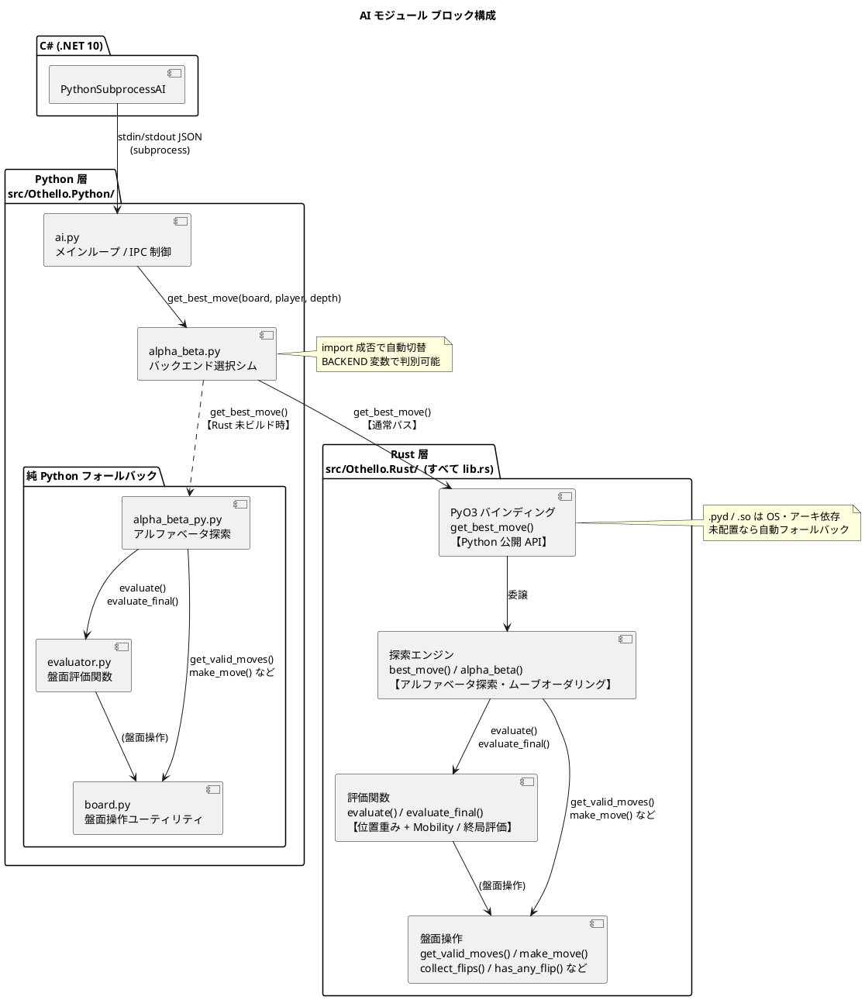
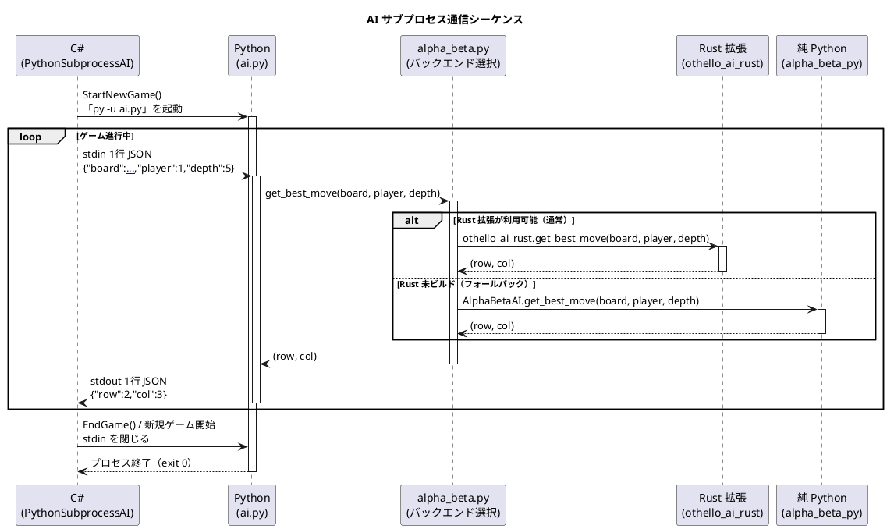
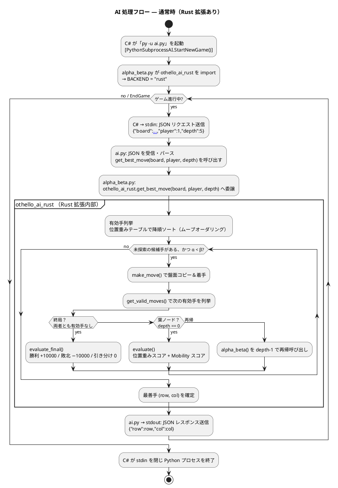
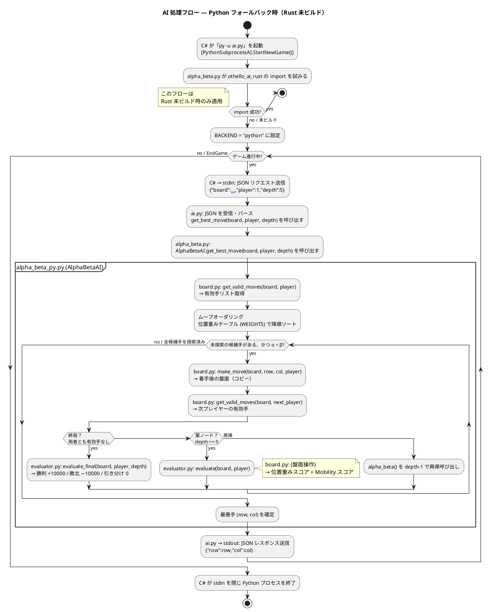
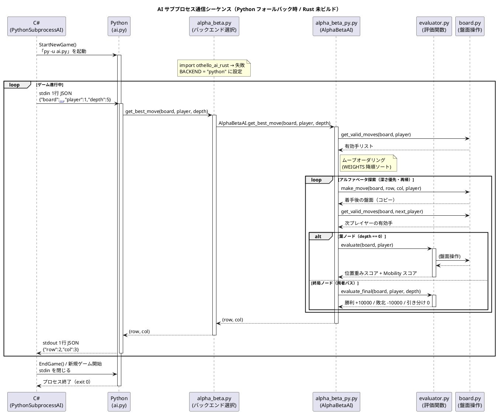

# AI 仕様書（Python 層）

> **この README は Python 層（`ai.py` / `alpha_beta_py.py` など）の詳細仕様書です。**  
> AI 層全体の概要・フォールバック構成・IPC プロトコル概要は [../README.md](../README.md) を参照してください。  
> C# フォールバック AI の詳細は [../CSharp/README.md](../CSharp/README.md) を参照してください。  
> Rust 拡張のビルド手順は [../Rust/README.md](../Rust/README.md) を参照してください。

---

## 1. 概要

本プロジェクトの AI はオセロ専用の思考エンジンです。探索の本体は **Rust（PyO3 拡張）** で実装し、Python がその窓口となって C# と連携します。  
C# (.NET 10 / WPF・WinUI3・コンソール) のゲーム本体とは別プロセスで動作し、**stdin / stdout を通じた JSON 通信**でやり取りを行います。

呼び出しの流れは **C# → Python → Rust** です。Python（`ai.py`）が C# からのリクエストを受け取り、探索処理を Rust 拡張（`othello_ai_rust`）へ委譲します。Rust 拡張が利用できない環境では、**純 Python 実装に自動でフォールバック**します（着手選択は同一で、変わるのは速度のみ）。

- **探索エンジン**: Rust（PyO3 / abi3 拡張モジュール）。フォールバックとして純 Python 実装を同梱
- **IPC 窓口**: Python 3.8 以上（`ai.py`）
- **アルゴリズム**: アルファベータ探索（Alpha-Beta Pruning）+ ムーブオーダリング
- **動作方式**: C# から起動されるサブプロセス（Python）として実行し、Python が Rust をインプロセスで呼び出す

---

## 2. モジュール構成

```
src/Othello.AI/Python/             Python 層（C# との窓口 + フォールバック）
├── ai.py             メインループ（起動時ハンドシェイク + C# との IPC 制御）
├── alpha_beta.py     バックエンド選択シム（Rust 優先 / Python フォールバック）
├── alpha_beta_py.py  純 Python アルファベータ探索（フォールバック実装）
├── evaluator.py      盤面評価関数（フォールバックが使用）
└── board.py          盤面操作ユーティリティ（フォールバックが使用）

src/Othello.AI/Rust/               Rust 層（探索本体・PyO3 拡張）
├── src/lib.rs        探索・評価・盤面操作（Python 版と挙動一致）
├── Cargo.toml
├── pyproject.toml    maturin ビルド設定
└── build_rust.ps1    ビルド & 拡張モジュール配置ヘルパー
```

| モジュール | 役割 |
|-----------|------|
| `ai.py` | stdin から JSON リクエストを受け取り、AI を呼び出して stdout へ結果を返すループ処理 |
| `alpha_beta.py` | バックエンド選択シム。`othello_ai_rust`（Rust）が import できれば委譲し、できなければ `alpha_beta_py` を使う。`BACKEND` 変数で現在の実装を判別できる |
| `alpha_beta_py.py` | 純 Python のアルファベータ探索エンジン（Rust 拡張が無い環境向けのフォールバック） |
| `evaluator.py` | 中盤評価（フェーズ切替 + 位置重み + Mobility + Stability + Frontier）と終局評価（石数差）を提供（フォールバックが使用） |
| `board.py` | 盤面の表現・有効手列挙・着手・反転計算などの純粋関数群（フォールバックが使用） |
| `Othello.Rust`（`lib.rs`） | 探索・評価・盤面操作の Rust 実装。PyO3 で `get_best_move(board, player, depth)` を Python へ公開する。内部盤面はフラットな `[i8; 64]` で高速に扱う |

![AI モジュール ブロック構成](https://www.plantuml.com/plantuml/svg/XLHDJnD16BxlhtYZbnAnrNZpO43aW4OWuisQPhOTwCRjxcPtIj8OatOtI96WDGgAYf5QGL04n0-C0Zzcs2tz5yx7RbbgrHwQsPbvFkPztfa-Xo2R50kwGZIYO-WV0khLgRjBlNVK-qMz3-nxWNeRrFEekncipWRLcg9OA7i7JM0uDN0Q4idXmPjm_bpFARYh0FjbpO9b6jWWS6kqHFAcCLPKBTlCOiVf7xeDo861CQGfzs8qSX_ususquTZPr0Z9Orqtat8-rOKPQKchb3QejqpT1lLsc5FXzncaO6Xq0FpgDtz_MQWnhJ_GkfL76HKJ5BBKvFce-rvmpRGgky63rzJzJhqtaaIL96tBpIzF8RHDlNdghibojQaYptzLpbWbAUxM1OvnB5DlaTEu1y73UlDBFLIsIjsOy2JIYuYOjc1flcoqbkf7Q_E7-ykjXNemloN0UB8RL3MHdOl1WYTpXtklgBSYpd2Vkc-fjou7WaND2PPx9pAxKNJ8dudnsHH0WbOMQUK7hQo0hgb9s-dU7ICNW1SiJ71Q2EzGTojjJ632gkIGJC6Sn8aULgPoBUgIgO-jXLde7nsYvSV2dwrgHgwJNPOmJ9Gtz4xQY36oFZdE8XJuHnJK-ybQGTHdWRhhOb0MLU9-sqOSZEniljDAF9Qq4GOdFKGVcN7DG7heut1lhhdtgJKzHoi7S0QkcwgcQwJ4jZU_klvsMVArHJb7fsGyM5bDjadBYSCxGhc0xk1sTREchkCioOphcYMNyyZ98ACaPjW4hQpJobfORTu-l1VuFUQwPyzU0f13W8lWa9ncfDY_MIHmTMnaE6qadFORqAD4EoLCZM0d8nSYlM3fg8JjNiXXY-GPL8r1HUnTeBA8hV8BVvV5_fYwFrYfsj1aKgXQ9VWhLBHsy8g5-qJqmqomw7AAI52gowmPXR_wz6ZZin9Do5KUYX0uZliu-YZj3emuSsJgH5vf8nPN68OIQNI04_7iUSdaKSKkF1bL-v-sJc3KN3oX_zkAD3h07ROKmoGOR6qYJy0Sv-yhWCRQrsQLhzRysWgjh1vDh_kpytvrEdXvm9OlzmzS6no-0dvZXbqajkvN6txrdVzeyyZRKp2BXdDsCaUF0tllSgolaux9Z6x2o1Y_qlp2iqk-SRY_v6yyPxjOwgqfVlluOTmPwQ3h0tyisCT6nOB-6m)

<details>
<summary>PlantUML ソース</summary>



</details>

---

## 3. C# との通信仕様（IPC プロトコル）

### 通信方式

- **方向**: C# プロセス ↔ Python サブプロセス
- **媒体**: 標準入出力（stdin / stdout）
- **形式**: 改行区切りの JSON（1リクエスト = 1行）
- **エンコーディング**: UTF-8（BOM なし）

### プロセスのライフサイクル

```
StartNewGame()
  └─ py -u ai.py を起動（1ゲームにつき1プロセス）
       ↓  起動直後: stdout に {"backend": "rust" | "python"} を出力（ハンドシェイク）
       ↑  C# がハンドシェイクを読んで EngineName（AI: Rust / AI: Python）を確定
       ↕  1 手ごとに JSON のやり取りを繰り返す
EndGame() / 新規ゲーム開始
  └─ stdin を閉じて Python プロセスを終了
```

> Python プロセス内では、`ai.py` が受け取ったリクエストを Rust 拡張（`othello_ai_rust.get_best_move`）へ委譲します（未ビルド時は純 Python 実装）。**C# から見た通信仕様は AI の実装言語に依らず不変**で、C# 側（`PythonSubprocessAI`）に変更はありません。


<details>
<summary>PlantUML ソース</summary>



</details>

### 3-1. 通常時（Rust 拡張あり）の処理フロー

`alpha_beta.py` が `othello_ai_rust` の import に成功（`BACKEND = "rust"`）した場合のフローです。探索・評価・盤面操作はすべて Rust 内部で完結するため、`board.py` / `evaluator.py` は呼び出されません。

![AI 処理フロー ― 通常時（Rust 拡張あり）](https://www.plantuml.com/plantuml/svg/ZPJTRXfN4CVlzob6snjG2BKlUeDhDMuQLMbLjwelZONMOLrMNNOHkyH2KQJzQ304I6iKJ4bjDT2eJjtOJUnQnGvMtY0FuV41ziglq3a7i74kekm5sZsS-StCVpvkMBQIjNDfNR8rMrTXxZQmjJ_xlnJGhwE_YtuNJfqw1CuJrkdqcjvvj_XzphAXLswnxY6w7deFpxibIH8SIOhT_0ZGhQ1JoUJXUWuKBPh9erD5hpOu_8-Lwt5ZyRkydJADXTno9clUKIrhxdPqWLlFgwjVAcar55wQ8P2YPr9AObcr5I9m9fXsIjLrCw5eYIoFWPYWfJDcreuRfuKQV3vty-jRyr_0BCZyVvaegocDaWgXjq-PeFyqSFO7hSfPP_UpC6WMXFAg5POa01usHrXsKZDYyDN2j_E0_Wvw_w3t7BqZz8k1uvwzQSMDU_AogMIJScnnCHgDBYr5v8okvDMi79kEo4arOwVas2VtPmHLP3_6UJNsSuCGwBz6Vvt7unt5ZHzKcvAqx4JQlAk613e2Gs8412uiJDUxw1wmjMDqcoFsf3wnkF6EEj4F0hiTjlruiBila1cgWMPhfW7okr9VBJihF0ZyvrHs6UwH7GNJsoonXqUzKfaL6xrACswSdLJx9tl1MXNTD-WNXFeRwF-DxdRGh0PF2-YTYCCYeQamemlUZdXnkFR-0NeloOc83M1KojxcJkzHk_zl6zqzvZG7VsoILzvnl1NBwBZeqkSpUFiAFeMt-vDr1l74qigFwb0KBi1s_xTdmLORlGFq7vFpyswXl-KGSsPydmjvLz6rf32oXbQz5oqAu29jNY6H-TXAMu5G_z1ZhvppxkyaHwSrS1wWIxtaNHgvE-Wsma1Q6rT29ASgUSmfjffOqGn53uNZ1YjliU9VS6rwYXxu67hr1giquBHO6v-mRXtTAYiMq5s7gN4agcwfF9h1UWdzHqBUaeX9z03CpiBK-qFWpg-KayQ1rFBQS0s-CPSrNRDfFiU7asuXn0fLrdav0Rtisf3ews4dNf_ccWulJtHwum9c9BKLQVGsQWJ334lZvdFOnayaA8Iovce4xfYwOFVRnspl2MVSlvp6yPYREVjYpb-82TyI7NTqEUS4asESA1DHZj4F7-l924ZqMqQIBwtmnUeRxX3kFzWeeVih3DSTkMdmXUgz5bBLg3dEZWipV76Q6Ua6KNDf_Ny0)

<details>
<summary>PlantUML ソース（アクティビティー図）</summary>



</details>

---

### 3-2. Python フォールバック時（Rust 未ビルド）の処理フロー

Rust 拡張（`othello_ai_rust.pyd` / `.so`）が配置されていない場合のフローです。`alpha_beta.py` が import の失敗を検知して `alpha_beta_py.AlphaBetaAI` へ切り替えます（`BACKEND = "python"`）。**C# から見た通信仕様は変わりません。**

![AI 処理フロー ― Python フォールバック時（Rust 未ビルド）](https://www.plantuml.com/plantuml/svg/dLNTJXj75BxtKnnjRzOAeN3HctLHGrAKqggqAfLwWP6rn4kywdftPQz3hIZIxcnZx80JC06N5fH0KSf_4cXK813U80_1CFwvuXLwPhp-WQONhI-idPapt_dEETyvSoFjg2adapH2ZkuO6lGF0fjyKPt9KN-U-ZlKFuOpTnw-pJe9omI-IJPma_fRr9-Xla_9oyeYkJZEVvT9Er1PsgJ-d3WiN1mNGY617Wefjpu2warJTzhEmlKCg7gtdQLkaP9IxSrVR6e-QeuqN0ndnkoKTKTBf_i7kuVvxI5juhQQrEJmQ0I1LCDEgB4npL4HWME2vIGqmx1YgXvBSGxKsmKzQLif_4JuZHVKEwLa2Y_huo079vNy37lqxBCmu6KJPDE2Zo-H3uS0b9lzjxuQ6FeS-a2o1Ja9mRTgwpjizzT8I3FI6iXPBSrjJSlH8ANVJJWAsimXXrR-gFSoQluZEvWqRkITrhsDwjDrX4WxbXtIpBW-7WfD97IiXKp9diZryxgxLrkPFZ_OGSPwEl3AAM9Upt8bl1lNJGM-7Fvc26kqYKMXP9sIG-hdwwvtVheIDUzBOvQQYalAo4XtT_VeQ9Ta6sfMIqbARvSKrsmd8IcVF8W8L56U9XmfiITbXA3-M-hFSZxaC6hUrHoiGjg99QrxcYoWkw21s0K2BYokpcBy-spoY7gB0NPd0PMesS_NDt69zVw_e3RAH7Tq5AZKXe_PMIuHkSD1M8Bxt1vf270H9NTwJpNqkF2Qlkms73LvVYjB1VRei5AO4idbQMLF5jYxSYH0mnA9GYrGiYa-N6xexrFoAcgUdnIh9xlroI8NefyB3Fqja7yO6BpznVV369JtHtsnM7-Ue-H4dES3v408g9pAuzNgdwke6UOkrdvVubomeJo2qgQkHprShi7xr_0flD-xef8h0IVL7xLB6KvP4rrmnpAk15rTTj4BUuTUTgk_hTMNLx7DATcd_bFaYEqT-G3ulsJJr7voOfTJkesAAbD_cv8rwg-9HjbjvRa5pNks-eQmr-x5yJFCvS5ApNr8FHGtQHV5swHUkTdBGKS6p3Gaar4TAoNO1IijDgwRgl5XXJNeiQbbbj-0Qxqz-EF3ORxCfijmbYyrTzZnFFMAB9-ZtYpqH0ANV2fmphNP0lKVYreM17C13drzqFDVY5vHOwHbtnuuhIs0TXdaHi4gSyNpawLmXmcFxP8WKSrOKh8Ar-1hQqmtT0V7QdEpTH7dad3P4IN8B5Ta1wywOcWtdomQjP7HwxrStmtZZjOjjrBMc7d1Pw1uCP7Pm_MssacfqGALWppo3eIjL9PSjl0pdeFSbB5mNLqz4bCQhHwqPrfpM5ePfpKjjqL3BujkFMnFIqIJ50uf8QIau1yVZbS83fXn_ZQ5MozSOn9p0lM50lL-QJ-SPVuQaBSYjILKzFbHBiBVHnpwDn0rapJ-1W00)

<details>
<summary>PlantUML ソース（アクティビティー図）</summary>



</details>

モジュール間の呼び出し順をより詳しく示したシーケンス図は以下のとおりです。

![AI Python フォールバック時シーケンス](https://www.plantuml.com/plantuml/svg/dLNVJzjM57xtNt7blO0QCjYqbqXCJI3gs3HMBLMdgQaYGzp6ccDRpWrjD5MAxJPB6jADTWcZWwc9q5PeOT0DGLSe_yjEx2HF_HTsV9qGkwK8pIznhi_vpdT-VVTYZWewpMTbZafK5abqXe2v1rO3h6Mmji1y1URBNl5n-xW9vZvOXs3kWlKN7huvB5ykq8og4B3gO6wutwndOFq4bWNcdywAIJuaN-Tpb3Yhcs0zOXyhRmuh7ATXI6bUqWI54dxgWwGouY4bydEQhiwBkLnqPfGdGevC9OB6dXqw259OAtWsbxyDsWYobX5ISo8Lq0HDJoY1-TIbRbLwne5p_pVFEnfxdtTAAtW0KVSeXYS3Lj7Osp751K7E2rJLFO_kHhtzkjbhj9pwZkSIlnfqc5C5FUqPTtvTxwsrd4Urzj6gPnoRvhYf11dx57CZ4P9mMpGhtheaPCMHqQG2nKMjGCRoX1K1YZKm7tRtzkrgdHFcgRGWKD4j2gUe-A8kY3eIHXWfgwaw9IhDYBAifWGffRlT-RVqaDZhkqvzEQd4ebDVn6UdoIJXDLPfde3nhFjqozv-p76ogceu7IzOfv_qYY-wpSNsmHP7yF7HpT6qf909_4W-JtmrcrI-zxBb8zUkXSFXwzT3l2OB1L7d8nCXFYrgDCD7Fhd3O0BytGD4H5p6_wP8iIyvcifYJYCCCaGyf11XCAD136mjEq1lXi7O-PeP_X-80ruC3L5ZqtrcE01IcW7bWaWU1DgD3KaugnNx_akdKWLh4rS9h38pOWtJfPiPxDADWIsMcXMy0UOcUocwJkuAxk3mV1EVkVJPbGJfhTHwJqfW7Z6JygZ7ij-n5jizND8cM2jiXu-T1wtEtotSOMT_5uowVNVJlbS6wvLTgja7E-wMaluJo3GhV2S6ggMhjq9aNfM3sRwRSMUjYEdQhnV1sFO67cE3YTluCn9Ygd1gmFUKLX5lqzJP4PtdJQPXpy5S1slTJTlOFYdyC9mWKz9Tge3rW9KE5QhCMayc9yculn1-Rl6h6A6_zE9f_Jv17umE2e3_7046AGO5863LpyYDzextCDFsKQrpjDtxeGR6iJjDM5MpHIwGBzKvIPPeWPmS1a3IucdaH3adaiwUQUyM_ILf7pIxnNjWBJ7bFqTHKZSaHP3FMAhpL6YOerrTiyiRvCB4E3vuiQ1SsOlBP6pmtpwiWr6pooKmbiZuUV9KqjpWrxVH0x4P6GosHzQ7uTS0Pi_udMK_L3AqHg5a4gdcQL0Z4O2FV1JY4OEFV7pdRHWCogZwX3QkfBqhmQr7OwVx-uz3SMvKxJ-gISNJOhmVUeqA6B-0MUNyFFoNFFQy_Ky9MotUbgWt-S7m5p5-FYl_1m00)

<details>
<summary>PlantUML ソース（シーケンス図）</summary>



</details>

---

### リクエスト（C# → Python stdin）

```json
{
  "board":   [[int, ...], ...],
  "player":  int,
  "depth":   int,
  "time_ms": int | null
}
```

| フィールド | 型 | 説明 |
|-----------|-----|------|
| `board` | `int[8][8]` | 現在の盤面。各セルの値: `0`=空、`1`=黒、`2`=白 |
| `player` | `int` | AI が担当するプレイヤーの色（`1`=黒、`2`=白） |
| `depth` | `int` | アルファベータ探索の最大深さ（1 以上必須）。難易度に対応（Beginner:1, Easy:2, Normal:5, Hard:10, Expert:12） |
| `time_ms` | `int \| null` | 反復深化探索の時間制限（ミリ秒）。Hard=`8000`、Expert=`15000`、Beginner/Easy/Normal=`null`（固定深さ探索） |

### レスポンス（Python stdout → C#）

**正常時:**
```json
{"row": int, "col": int}
```

**エラー時:**
```json
{"error": "エラーメッセージ"}
```

| フィールド | 型 | 説明 |
|-----------|-----|------|
| `row` | `int` | 着手先の行（0〜7） |
| `col` | `int` | 着手先の列（0〜7） |

---

## 4. 盤面の表現

盤面は `8×8` の整数配列で表現します。行優先（row-major）です。

```
board[0][0]  board[0][1]  ...  board[0][7]   ← 1行目（上端）
board[1][0]  ...
...
board[7][0]  ...                board[7][7]   ← 8行目（下端）
```

列は左（`col=0`）から右（`col=7`）、行は上（`row=0`）から下（`row=7`）を正とします。

| 値 | 意味 |
|----|------|
| `0` | 空きマス（Empty） |
| `1` | 黒（Black） |
| `2` | 白（White） |

---

## 5. アルゴリズム詳細

> 探索アルゴリズムは **Rust 実装（`Othello.Rust`）と純 Python フォールバック（`alpha_beta_py.py`）で同一**です。以下の擬似コード・式は両者に共通して当てはまり、同じ盤面・深さに対して同じ手を返すことを整合性テスト（`test_parity.py`）で検証しています。

### 5-1. アルファベータ探索

ミニマックス法（Minimax）に **アルファベータ枝刈り** を適用した探索アルゴリズムです。

```
get_best_move(board, player, depth)
  ├─ 有効手を列挙してムーブオーダリングで並び替える
  └─ 各手について _alpha_beta() を呼び出し、最高スコアの手を選択する

_alpha_beta(board, depth, alpha, beta, is_maximizing, ai_player)
  ├─ depth == 0  → evaluate() で評価値を返す（葉ノード）
  ├─ 両者パス   → evaluate_final() で終局評価を返す
  ├─ 現在プレイヤーがパス → is_maximizing を反転して depth-1 で再帰
  ├─ 最大化ターン → alpha を更新、alpha >= beta でベータカット
  └─ 最小化ターン → beta を更新、alpha >= beta でアルファカット
```

**特徴:**
- 深さ優先探索（DFS）
- α（最大化側の下限）/ β（最小化側の上限）を管理して無駄な探索を省略
- パスは深さを消費せずにプレイヤーを入れ替えて継続

### 5-2. ムーブオーダリング

アルファベータ探索の枝刈り効率を高めるため、**着手を事前にソート** してから探索します。

```python
moves.sort(key=lambda m: WEIGHTS[m[0]][m[1]], reverse=True)
```

位置重みテーブル（`WEIGHTS`）の高い手（コーナー・辺など）を優先探索することで、早期に良い手が見つかり、より多くの枝を刈り落とせます。

Rust 実装も同じく位置重みの降順で **安定ソート**します（`moves.sort_by(|a, b| WEIGHTS[b.0][b.1].cmp(&WEIGHTS[a.0][a.1]))`）。安定ソートかつ手の列挙順（行優先）が一致するため、同じ重みの手の並び順も Python と揃い、両実装で同一の手が選ばれます。

### 5-3. トランスポジションテーブル（TT）

同一局面の再探索を省略するためのキャッシュです。Zobrist ハッシュを使い、C# 版 `AlphaBetaAI` と同じ意味論で実装されています。

- **キー**: `(盤面の Zobrist ハッシュ, is_maximizing)` のタプル。手番の違いを区別するため `is_maximizing` を含める
- **値**: `(score, depth, NodeType)` のタプル
- **生存期間**: 1 回の探索呼び出し（`get_best_move` / `get_best_move_timed` の 1 回分）専用。呼び出しをまたいで永続化しない

| `NodeType` | 意味 | 再利用条件 |
|-----------|------|-----------|
| `EXACT` | αβ窓内で得た正確値 | そのまま返す |
| `LOWER_BOUND` | βカット（fail-high）で得た下界値 | `alpha = max(alpha, score)` |
| `UPPER_BOUND` | αを改善できなかった（fail-low）上界値 | `beta = min(beta, score)` |

Zobrist ハッシュは盤面のみをハッシュ化します（手番はハッシュに含めず、TT キーの `is_maximizing` で区別）。固定シード（`42`）の決定論的乱数テーブルから生成するため、C#/Rust 版と同一のハッシュ列になります。

---

## 6. 評価関数

> 評価ロジック・重みテーブル（`WEIGHTS`）・各係数は **Rust 実装と純 Python 実装で完全に同一**です（`test_parity.py` で検証）。

### 6-1. 中盤評価（`evaluate`）

探索深さが 0 に達した葉ノードで使用します。空きマス数に応じてフェーズ（序盤/中盤/終盤）を切り替え、重みを動的に変化させます。

```
序盤（空きマス > 44）: 位置重みスコア + Mobility スコア × 20
中盤（20 ≤ 空きマス ≤ 44）: 位置重みスコア + Mobility スコア × 10 + Stability スコア × 25 + Frontier スコア × 5
終盤（空きマス < 20）: 石数差 × 10 + 位置重みスコア + Mobility スコア × 10
```

**① 位置重みスコア（全フェーズ共通）**

```
AI の石があるマスの重み合計 − 相手の石があるマスの重み合計
```

位置重みテーブル（`WEIGHTS`）:

```
[100, -20,  10,   5,   5,  10, -20, 100]
[-20, -50,  -2,  -2,  -2,  -2, -50, -20]
[ 10,  -2,   5,   1,   1,   5,  -2,  10]
[  5,  -2,   1,   2,   2,   1,  -2,   5]
[  5,  -2,   1,   2,   2,   1,  -2,   5]
[ 10,  -2,   5,   1,   1,   5,  -2,  10]
[-20, -50,  -2,  -2,  -2,  -2, -50, -20]
[100, -20,  10,   5,   5,  10, -20, 100]
```

| マスの種類 | 重み | 理由 |
|-----------|------|------|
| コーナー（4隅） | +100 | 一度取ると取り返せない最重要マス |
| X-square（コーナー斜め隣） | −50 | 取るとコーナーを相手に献上するリスクが高い |
| C-square（コーナー辺隣） | −20 | X-square と同様にリスクが高い |
| 辺（端の行・列） | +10 | 比較的安定しやすい |
| 内側の辺隣 | −2 | 辺を相手に渡す起点になりやすい |
| 中央付近 | +1〜+5 | 序盤の主戦場、終盤では相対的に価値が低下 |

**② Mobility スコア（全フェーズ共通、係数はフェーズにより変動）**

```
AI の有効手数 − 相手の有効手数
```

着手の選択肢が多いほど有利とみなします。序盤は係数 20、中盤・終盤は係数 10 で、序盤ほど選択肢の多さを重視します。

**③ Stability スコア（安定石、中盤のみ）**

`count_stable(board, player)` が、絶対にひっくり返せない石（コーナー起点の flood-fill で 4 軸〈横・縦・斜め2方向〉すべて安定と判定された石）の数を返します。

```
(AI の安定石数 − 相手の安定石数) × 25
```

**④ Frontier スコア（フロンティア、中盤のみ）**

`count_frontier(board, player)` が、空きマスに隣接する石（不安定性の代理指標）の数を返します。フロンティアが少ないほど守りやすい盤面とみなします。

```
(相手のフロンティア数 − AI のフロンティア数) × 5
```

### 6-2. 終局評価（`evaluate_final`）

両者ともに有効手がなくなった終局ノードで使用します。残り探索深さ `depth` を加算することで、同じ勝敗でも「より早く決まる勝ち」を高く、「より早く決まる負け」を低く評価します（AI は最短で勝ちにいき、負けは可能な限り引き延ばします）。

| 結果 | 返す値 |
|------|--------|
| AI の石が多い（勝利） | `+(10000 + depth)`（早い勝ちほど高評価） |
| AI の石が少ない（敗北） | `−(10000 + depth)`（早い負けほど低評価） |
| 同数（引き分け） | `0` |

中盤評価値（最大でも数百程度）と桁を大きく離すことで、終局の勝敗を中盤評価より常に優先します。

---

## 7. 難易度設定

難易度は C# 側から `depth` / `time_ms` パラメータとして渡されます。

| 難易度 | 探索方式 | 探索深さ | `time_ms` | 目安計算時間 | 特徴 |
|--------|---------|---------|-----------|------------|------|
| ビギナー | 固定深さ | 1 | `null` | 即座 | 1 手先のみ読む。オセロを始めたばかりの人向け |
| イージー | 固定深さ | 2 | `null` | 即座（〜100ms） | 1〜2 手先のみ読む。初心者向け |
| ノーマル | 固定深さ | 5 | `null` | 1〜2 秒 | 中程度の先読み。一般的なプレイヤーに相当 |
| ハード | 反復深化 | 最大 10 | `8000` | 最大 8 秒 | 深さ 1 から順に探索し時間制限内に最善手を確定。コーナー周辺の戦略を正確に評価できる |
| エキスパート | 反復深化 | 最大 12 | `15000` | 最大 15 秒 | ハードよりさらに深く読む。上級者向け |

- **固定深さ**（Beginner / Easy / Normal）: `get_best_move(board, player, depth)` を使用
- **反復深化**（Hard / Expert）: `get_best_move_timed(board, player, depth, time_ms)` を使用。時間切れ前の最深深さの結果を採用する

※ 計算時間は局面の複雑さにより大きく変動します。序盤・終盤は手数が少ないため速く、中盤は手数が多いため遅くなります。

---

## 8. 制約・制限事項

| 項目 | 内容 |
|------|------|
| 応答タイムアウト | 60 秒。これを超えると C# 側がプロセスを強制終了してエラー扱いにする |
| Python バージョン | 3.8 以上必須（`sys.stdin.reconfigure` を使用） |
| AI バックエンド | Rust 拡張（`othello_ai_rust`）があれば使用し、無ければ純 Python に自動フォールバック。生成物（`.pyd`/`.so`）は OS・アーキテクチャ依存のためリポジトリ非同梱（環境ごとにビルド） |
| 実行時の依存 | 純 Python フォールバックは標準ライブラリのみ。Rust 拡張も実行時は追加 pip パッケージ不要（ビルド済みモジュールを import するのみ） |
| ビルド時の依存 | Rust 拡張のビルドには Rust ツールチェーン・maturin・C リンカ（Windows は MSVC `link.exe`）が必要 |
| 状態の保持 | AI はリクエストのたびに盤面を受け取るステートレス設計のため、過去の局面情報は保持しない |
| 並列探索 | 非対応（シングルスレッドの探索。Rust・Python とも同様） |
| 定石・開局データ | 対応（`opening_book.py`。標準記譜法で定義した機械検証済みの定石を起動時に検証し、盤面+手番をキーとする辞書として保持。`decide_move()` から優先参照し、ヒットしない場合は通常探索にフォールバックする） |

---

## 9. 拡張の方向性

> AI 本体の **Rust 化（高速化）・反復深化（全バックエンド）・評価関数のフェーズ切替（序盤/中盤/終盤 + Stability/Frontier）・定石（Opening Book）は実施済み**です。以下はさらなる改善案で、いずれも Rust 実装（`Othello.AI/Rust`）側で取り組むのが効果的です。

| 改善項目 | 手法 |
|---------|------|
| 探索速度の更なる向上 | Rust 実装へのビットボード化 |
| 強化 | 強化学習による重みテーブルの最適化 |
| 配布の簡素化 | Rust 拡張をプラットフォーム別にビルドして同梱、または `ai.exe` 化（実行環境の Python / Rust 不要化） |
