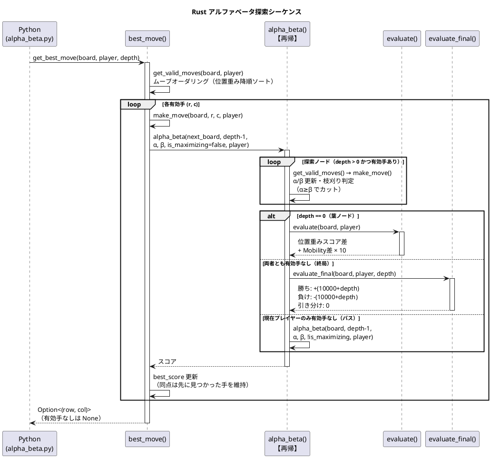

# Othello.AI/Rust — PyO3 Rust 拡張

オセロ AI の探索本体を Rust で実装した PyO3 拡張クレート。  
Python 層（`src/Othello.AI/Python/`）が `othello_ai_rust.get_best_move()` / `othello_ai_rust.get_best_move_timed()` を呼び出すことで、アルファベータ探索を高速に実行します。Rust 拡張が未ビルドの環境では純 Python 実装に自動フォールバックします。

> **AI 層全体の概要・フォールバック構成は [../README.md](../README.md) を参照してください。**  
> アルゴリズム・評価関数・IPC プロトコルの詳細は [../Python/README.md](../Python/README.md) を参照してください。  
> C# フォールバック AI については [../CSharp/README.md](../CSharp/README.md) を参照してください。

---

## 前提ツール

| ツール | 用途 |
|--------|------|
| [Rust toolchain](https://rustup.rs/) | `cargo build` / `cargo test` |
| [maturin](https://github.com/PyO3/maturin) | PyO3 拡張のビルド（`py -m pip install --user maturin`） |
| MSVC `link.exe`（Windows） | C リンカ（VS Build Tools に同梱） |
| Python 3.8 以上 | maturin のビルド時に 1 つ必要 |

---

## ビルド手順

```powershell
# リポジトリルートから実行
pwsh -File src/Othello.AI/Rust/build_rust.ps1
```

スクリプトが行うこと:

1. `maturin build --release` で abi3 ホイール（`.whl`）を生成
2. ホイール内の拡張モジュール（`othello_ai_rust.pyd` / `othello_ai_rust*.so`）を `src/Othello.AI/Python/` へ配置
3. 以降の `dotnet build` が `.pyd`/`.so` を出力ディレクトリへコピーし、実行時に Python が Rust 実装を import する

> **Windows の `.pyd` ロック対策**: Python プロセスが `.pyd` を読み込み中にビルドすると `IOException` が発生することがあります。スクリプトは最大 5 回（1 秒間隔）リトライするため、通常はそのまま再実行するか、Python プロセスを終了してから再試行してください。

---

## テスト

Rust ロジックの単体テストは `src/lib.rs` の `#[cfg(test)]` モジュールに記述されています。
PyO3 を切り離したピュア Rust として実行するため `--no-default-features` を指定します。

```bash
cargo test --manifest-path src/Othello.AI/Rust/Cargo.toml --no-default-features
```

Python と Rust の着手一致確認（固定深さ・反復深化の両経路）は `src/Othello.AI/Python/test_parity.py` で行います（Rust 未ビルド時は自動スキップ）。

```bash
py -m unittest discover -s src/Othello.AI/Python -p "test_*.py"
```

---

## 探索シーケンス

![Rust アルファベータ探索シーケンス](https://www.plantuml.com/plantuml/svg/TLHHJzfG57xlhxZp2I9i-4gcKHDvSpDxC34X8GMgDYijeSN9dcWx6QWuCL7ZffiojXdTc3WtDSFvi7T-XCU2FkqlxFG2fKMyJ-szvtpt-yxvpXsM5JQX96C2e_2Am95dILaXe1L1FmHz7RGzqBT0hu9sMLyfDawAe9tItmheFq0xPvWuflCHFiwA2kcRI2cpaXWKNQmGdsL3OKvX7yPJxZx2ocHYoXaRvcGb59FcE5VpV7JSUTw1SBc38gHNZKpUE3k2T866ZumwmxavLaYoIXjjRBBtSMYQ5rcX7HHWc8afuXt2oucVp71AgCCgBB69g8V41JR59JmaoiMLMJV3HXH-3d5CkWncsNFn2ZvAasLdjibVtpNhfc-0Ta0_qg0Vq1eU_Qjcho_oZOloxUiyg9UtM_dRtGne5pGi-w-QOnX1akB4M7rLtyuPY-Vrt19n8QM8co6uR2nYx7FEmTwCibZOeaT6CTfMOP6RH-tD7AhKE-09YhMAXzIEFOINGp5sde_nBtbnPd2Q5MJE2MfL1Rj2DoZXbcFq5QeaXpefD1aYFWBg4gWbIm-e6cYBfbRIMiYmpRExjcvobLcpQNMRJ1_LZadztKbzumZqt_NtEqOsYuX6jcIKtmP5lBjMkSfzmY1Glu26vjPRnJKluyHeapShA4tzP72G-33hff2p2UYcDpQ9z2pdENjkXLh5GK-szp3HsvPdRpwE56XeYg9nMWwA_MHS2lC2hwJmb_pT90C-2o7ATUDos1PoVRPtaru0THyqpLRT0r0tKKtZfsPKqZrq16mwMYFIs_ztHGKweW8TKSRI3gXxVjBl6l3Xwc-c1yMRurrG2txYxTetgkkWveriXfxsbXdeo6oy-MDixuE-2VfNq4gWbymMgMKiuLtLe1UmhlUOopO4z_h_WMC0d1ssh6DYjkVGQYFJfQ4z7xQPfI-E794INCk_rAt6wd83GTJlna8MrCERp-QuqA7v2Ee7KvssrlZrhRwichee2HCJGV51yvEdSOMNnCUkXFG2Nm19S0zHrAxQ83nv8ecS2M4ZYK_RC28cOy9_)

<details>
<summary>PlantUML ソース</summary>



</details>

---

## ファイル構成

| ファイル | 内容 |
|---------|------|
| `src/lib.rs` | 探索・評価・盤面操作の全実装 + 単体テスト |
| `Cargo.toml` | クレート定義。`python` フィーチャで PyO3 バインディングを有効化 |
| `pyproject.toml` | maturin ビルド設定（abi3-py38） |
| `build_rust.ps1` | ビルド & 拡張モジュール配置ヘルパー（PowerShell）。`.pyd` ロック時は最大 5 回リトライ |
