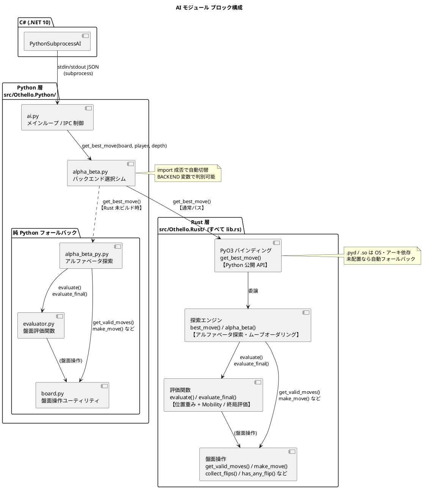
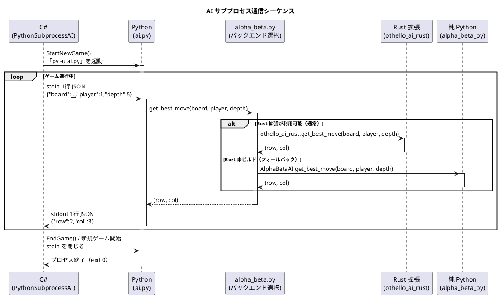

# AI 仕様書

## 1. 概要

本プロジェクトの AI はオセロ専用の思考エンジンです。探索の本体は **Rust（PyO3 拡張）** で実装し、Python がその窓口となって C# と連携します。  
C# (.NET 10 / WPF・WinUI3・コンソール) のゲーム本体とは別プロセスで動作し、**stdin / stdout を通じた JSON 通信**でやり取りを行います。

呼び出しの流れは **C# → Python → Rust** です。Python（`ai.py`）が C# からのリクエストを受け取り、探索処理を Rust 拡張（`othello_ai_rust`）へ委譲します。Rust 拡張が利用できない環境では、**純 Python 実装に自動でフォールバック**します（着手選択は同一で、変わるのは速度のみ）。

- **探索エンジン**: Rust（PyO3 / abi3 拡張モジュール）。フォールバックとして純 Python 実装を同梱
- **IPC 窓口**: Python 3.8 以上（`ai.py`）
- **アルゴリズム**: アルファベータ探索（Alpha-Beta Pruning）+ ムーブオーダリング
- **動作方式**: C# から起動されるサブプロセス（Python）として実行し、Python が Rust をインプロセスで呼び出す

---

## 2. モジュール構成

```
src/Othello.Python/                Python 層（C# との窓口 + フォールバック）
├── ai.py             メインループ（C# との IPC 制御）
├── alpha_beta.py     バックエンド選択シム（Rust 優先 / Python フォールバック）
├── alpha_beta_py.py  純 Python アルファベータ探索（フォールバック実装）
├── evaluator.py      盤面評価関数（フォールバックが使用）
└── board.py          盤面操作ユーティリティ（フォールバックが使用）

src/Othello.Rust/                  Rust 層（探索本体・PyO3 拡張）
├── src/lib.rs        探索・評価・盤面操作（Python 版と挙動一致）
├── Cargo.toml
├── pyproject.toml    maturin ビルド設定
└── build_rust.ps1    ビルド & 拡張モジュール配置ヘルパー
```

| モジュール | 役割 |
|-----------|------|
| `ai.py` | stdin から JSON リクエストを受け取り、AI を呼び出して stdout へ結果を返すループ処理 |
| `alpha_beta.py` | バックエンド選択シム。`othello_ai_rust`（Rust）が import できれば委譲し、できなければ `alpha_beta_py` を使う。`BACKEND` 変数で現在の実装を判別できる |
| `alpha_beta_py.py` | 純 Python のアルファベータ探索エンジン（Rust 拡張が無い環境向けのフォールバック） |
| `evaluator.py` | 中盤評価（位置重み + Mobility）と終局評価（石数差）を提供（フォールバックが使用） |
| `board.py` | 盤面の表現・有効手列挙・着手・反転計算などの純粋関数群（フォールバックが使用） |
| `Othello.Rust`（`lib.rs`） | 探索・評価・盤面操作の Rust 実装。PyO3 で `get_best_move(board, player, depth)` を Python へ公開する。内部盤面はフラットな `[i8; 64]` で高速に扱う |

![AI モジュール ブロック構成](https://www.plantuml.com/plantuml/svg/XLHDJnD16BxlhtYZbnAnrNZpO43aW4OWuisQPhOTwCRjxcPtIj8OatOtI96WDGgAYf5QGL04n0-C0Zzcs2tz5yx7RbbgrHwQsPbvFkPztfa-Xo2R50kwGZIYO-WV0khLgRjBlNVK-qMz3-nxWNeRrFEekncipWRLcg9OA7i7JM0uDN0Q4idXmPjm_bpFARYh0FjbpO9b6jWWS6kqHFAcCLPKBTlCOiVf7xeDo861CQGfzs8qSX_ususquTZPr0Z9Orqtat8-rOKPQKchb3QejqpT1lLsc5FXzncaO6Xq0FpgDtz_MQWnhJ_GkfL76HKJ5BBKvFce-rvmpRGgky63rzJzJhqtaaIL96tBpIzF8RHDlNdghibojQaYptzLpbWbAUxM1OvnB5DlaTEu1y73UlDBFLIsIjsOy2JIYuYOjc1flcoqbkf7Q_E7-ykjXNemloN0UB8RL3MHdOl1WYTpXtklgBSYpd2Vkc-fjou7WaND2PPx9pAxKNJ8dudnsHH0WbOMQUK7hQo0hgb9s-dU7ICNW1SiJ71Q2EzGTojjJ632gkIGJC6Sn8aULgPoBUgIgO-jXLde7nsYvSV2dwrgHgwJNPOmJ9Gtz4xQY36oFZdE8XJuHnJK-ybQGTHdWRhhOb0MLU9-sqOSZEniljDAF9Qq4GOdFKGVcN7DG7heut1lhhdtgJKzHoi7S0QkcwgcQwJ4jZU_klvsMVArHJb7fsGyM5bDjadBYSCxGhc0xk1sTREchkCioOphcYMNyyZ98ACaPjW4hQpJobfORTu-l1VuFUQwPyzU0f13W8lWa9ncfDY_MIHmTMnaE6qadFORqAD4EoLCZM0d8nSYlM3fg8JjNiXXY-GPL8r1HUnTeBA8hV8BVvV5_fYwFrYfsj1aKgXQ9VWhLBHsy8g5-qJqmqomw7AAI52gowmPXR_wz6ZZin9Do5KUYX0uZliu-YZj3emuSsJgH5vf8nPN68OIQNI04_7iUSdaKSKkF1bL-v-sJc3KN3oX_zkAD3h07ROKmoGOR6qYJy0Sv-yhWCRQrsQLhzRysWgjh1vDh_kpytvrEdXvm9OlzmzS6no-0dvZXbqajkvN6txrdVzeyyZRKp2BXdDsCaUF0tllSgolaux9Z6x2o1Y_qlp2iqk-SRY_v6yyPxjOwgqfVlluOTmPwQ3h0tyisCT6nOB-6m)

<details>
<summary>PlantUML ソース</summary>



</details>

---

## 3. C# との通信仕様（IPC プロトコル）

### 通信方式

- **方向**: C# プロセス ↔ Python サブプロセス
- **媒体**: 標準入出力（stdin / stdout）
- **形式**: 改行区切りの JSON（1リクエスト = 1行）
- **エンコーディング**: UTF-8（BOM なし）

### プロセスのライフサイクル

```
StartNewGame()
  └─ py -u ai.py を起動（1ゲームにつき1プロセス）
       ↕  JSON のやり取りを繰り返す
EndGame() / 新規ゲーム開始
  └─ stdin を閉じて Python プロセスを終了
```

> Python プロセス内では、`ai.py` が受け取ったリクエストを Rust 拡張（`othello_ai_rust.get_best_move`）へ委譲します（未ビルド時は純 Python 実装）。**C# から見た通信仕様は AI の実装言語に依らず不変**で、C# 側（`PythonSubprocessAI`）に変更はありません。


<details>
<summary>PlantUML ソース</summary>



</details>

### リクエスト（C# → Python stdin）

```json
{
  "board":  [[int, ...], ...],
  "player": int,
  "depth":  int
}
```

| フィールド | 型 | 説明 |
|-----------|-----|------|
| `board` | `int[8][8]` | 現在の盤面。各セルの値: `0`=空、`1`=黒、`2`=白 |
| `player` | `int` | AI が担当するプレイヤーの色（`1`=黒、`2`=白） |
| `depth` | `int` | アルファベータ探索の最大深さ（難易度に対応） |

### レスポンス（Python stdout → C#）

**正常時:**
```json
{"row": int, "col": int}
```

**エラー時:**
```json
{"error": "エラーメッセージ"}
```

| フィールド | 型 | 説明 |
|-----------|-----|------|
| `row` | `int` | 着手先の行（0〜7） |
| `col` | `int` | 着手先の列（0〜7） |

---

## 4. 盤面の表現

盤面は `8×8` の整数配列で表現します。行優先（row-major）です。

```
board[0][0]  board[0][1]  ...  board[0][7]   ← 1行目（上端）
board[1][0]  ...
...
board[7][0]  ...                board[7][7]   ← 8行目（下端）
```

列は左（`col=0`）から右（`col=7`）、行は上（`row=0`）から下（`row=7`）を正とします。

| 値 | 意味 |
|----|------|
| `0` | 空きマス（Empty） |
| `1` | 黒（Black） |
| `2` | 白（White） |

---

## 5. アルゴリズム詳細

> 探索アルゴリズムは **Rust 実装（`Othello.Rust`）と純 Python フォールバック（`alpha_beta_py.py`）で同一**です。以下の擬似コード・式は両者に共通して当てはまり、同じ盤面・深さに対して同じ手を返すことを整合性テスト（`test_parity.py`）で検証しています。

### 5-1. アルファベータ探索

ミニマックス法（Minimax）に **アルファベータ枝刈り** を適用した探索アルゴリズムです。

```
get_best_move(board, player, depth)
  ├─ 有効手を列挙してムーブオーダリングで並び替える
  └─ 各手について _alpha_beta() を呼び出し、最高スコアの手を選択する

_alpha_beta(board, depth, alpha, beta, is_maximizing, ai_player)
  ├─ depth == 0  → evaluate() で評価値を返す（葉ノード）
  ├─ 両者パス   → evaluate_final() で終局評価を返す
  ├─ 現在プレイヤーがパス → is_maximizing を反転して depth-1 で再帰
  ├─ 最大化ターン → alpha を更新、alpha >= beta でベータカット
  └─ 最小化ターン → beta を更新、alpha >= beta でアルファカット
```

**特徴:**
- 深さ優先探索（DFS）
- α（最大化側の下限）/ β（最小化側の上限）を管理して無駄な探索を省略
- パスは深さを消費せずにプレイヤーを入れ替えて継続

### 5-2. ムーブオーダリング

アルファベータ探索の枝刈り効率を高めるため、**着手を事前にソート** してから探索します。

```python
moves.sort(key=lambda m: WEIGHTS[m[0]][m[1]], reverse=True)
```

位置重みテーブル（`WEIGHTS`）の高い手（コーナー・辺など）を優先探索することで、早期に良い手が見つかり、より多くの枝を刈り落とせます。

Rust 実装も同じく位置重みの降順で **安定ソート**します（`moves.sort_by(|a, b| WEIGHTS[b.0][b.1].cmp(&WEIGHTS[a.0][a.1]))`）。安定ソートかつ手の列挙順（行優先）が一致するため、同じ重みの手の並び順も Python と揃い、両実装で同一の手が選ばれます。

---

## 6. 評価関数

> 評価ロジック・重みテーブル（`WEIGHTS`）・各係数は **Rust 実装と純 Python 実装で完全に同一**です。Rust 化によって評価値そのものは変わりません。

### 6-1. 中盤評価（`evaluate`）

探索深さが 0 に達した中間ノードで使用します。2 つの要素を組み合わせた評価値を返します。

```
評価値 = 位置重みスコア + Mobility スコア
```

**① 位置重みスコア**

```
AI の石があるマスの重み合計 − 相手の石があるマスの重み合計
```

位置重みテーブル（`WEIGHTS`）:

```
[100, -20,  10,   5,   5,  10, -20, 100]
[-20, -50,  -2,  -2,  -2,  -2, -50, -20]
[ 10,  -2,   5,   1,   1,   5,  -2,  10]
[  5,  -2,   1,   2,   2,   1,  -2,   5]
[  5,  -2,   1,   2,   2,   1,  -2,   5]
[ 10,  -2,   5,   1,   1,   5,  -2,  10]
[-20, -50,  -2,  -2,  -2,  -2, -50, -20]
[100, -20,  10,   5,   5,  10, -20, 100]
```

| マスの種類 | 重み | 理由 |
|-----------|------|------|
| コーナー（4隅） | +100 | 一度取ると取り返せない最重要マス |
| X-square（コーナー斜め隣） | −50 | 取るとコーナーを相手に献上するリスクが高い |
| C-square（コーナー辺隣） | −20 | X-square と同様にリスクが高い |
| 辺（端の行・列） | +10 | 比較的安定しやすい |
| 内側の辺隣 | −2 | 辺を相手に渡す起点になりやすい |
| 中央付近 | +1〜+5 | 序盤の主戦場、終盤では相対的に価値が低下 |

**② Mobility スコア**

```
(AI の有効手数 − 相手の有効手数) × 10
```

着手の選択肢が多いほど有利とみなします。係数 10 は位置重みとのバランス調整のための定数です。

### 6-2. 終局評価（`evaluate_final`）

両者ともに有効手がなくなった終局ノードで使用します。

| 結果 | 返す値 |
|------|--------|
| AI の石が多い（勝利） | +10000 |
| AI の石が少ない（敗北） | −10000 |
| 同数（引き分け） | 0 |

中盤評価値（最大でも数百程度）と桁を大きく離すことで、終局の勝敗を中盤評価より常に優先します。

---

## 7. 難易度設定

難易度は C# 側から `depth` パラメータとして渡されます。

| 難易度 | 探索深さ | 目安計算時間 | 特徴 |
|--------|---------|------------|------|
| イージー | 2 | 即座（〜100ms） | 1〜2 手先のみ読む。初心者向け |
| ノーマル | 5 | 1〜2 秒 | 中程度の先読み。一般的なプレイヤーに相当 |
| ハード | 10 | 3〜5 秒 | 深い先読み。コーナー周辺の戦略を正確に評価できる |

※ 計算時間は局面の複雑さにより大きく変動します。序盤・終盤は手数が少ないため速く、中盤は手数が多いため遅くなります。

---

## 8. 制約・制限事項

| 項目 | 内容 |
|------|------|
| 応答タイムアウト | 60 秒。これを超えると C# 側がプロセスを強制終了してエラー扱いにする |
| Python バージョン | 3.8 以上必須（`sys.stdin.reconfigure` を使用） |
| AI バックエンド | Rust 拡張（`othello_ai_rust`）があれば使用し、無ければ純 Python に自動フォールバック。生成物（`.pyd`/`.so`）は OS・アーキテクチャ依存のためリポジトリ非同梱（環境ごとにビルド） |
| 実行時の依存 | 純 Python フォールバックは標準ライブラリのみ。Rust 拡張も実行時は追加 pip パッケージ不要（ビルド済みモジュールを import するのみ） |
| ビルド時の依存 | Rust 拡張のビルドには Rust ツールチェーン・maturin・C リンカ（Windows は MSVC `link.exe`）が必要 |
| 状態の保持 | AI はリクエストのたびに盤面を受け取るステートレス設計のため、過去の局面情報は保持しない |
| 並列探索 | 非対応（シングルスレッドの探索。Rust・Python とも同様） |
| 定石・開局データ | 非対応（完全にアルゴリズムで計算） |

---

## 9. 拡張の方向性

> AI 本体の **Rust 化（高速化）は実施済み**です。以下はさらなる改善案で、いずれも Rust 実装（`Othello.Rust`）側で取り組むのが効果的です。

| 改善項目 | 手法 |
|---------|------|
| 探索速度の更なる向上 | Rust 実装への反復深化（Iterative Deepening）・置換表（Transposition Table）の導入、ビットボード化 |
| 評価精度の向上 | 局面フェーズ（序盤・中盤・終盤）に応じた評価関数の切り替え |
| 強化 | 強化学習による重みテーブルの最適化 |
| 配布の簡素化 | Rust 拡張をプラットフォーム別にビルドして同梱、または `ai.exe` 化（実行環境の Python / Rust 不要化） |
