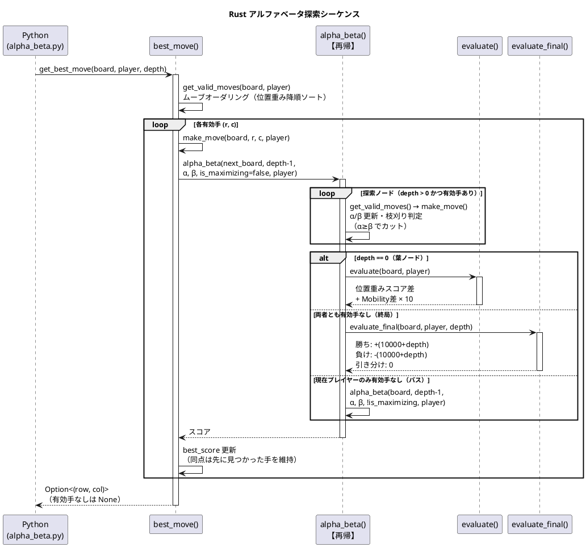

# Othello.Rust

オセロ AI の探索本体を Rust で実装した PyO3 拡張クレート。  
Python 層（`src/Othello.Python/`）が `othello_ai_rust.get_best_move()` を呼び出すことで、
アルファベータ探索を高速に実行します。Rust 拡張が未ビルドの環境では純 Python 実装に自動フォールバックします。

アルゴリズム・評価関数・IPC プロトコルの詳細は [src/Othello.Python/README.md](../Othello.Python/README.md) を参照してください。

---

## 前提ツール

| ツール | 用途 |
|--------|------|
| [Rust toolchain](https://rustup.rs/) | `cargo build` / `cargo test` |
| [maturin](https://github.com/PyO3/maturin) | PyO3 拡張のビルド（`py -m pip install --user maturin`） |
| MSVC `link.exe`（Windows） | C リンカ（VS Build Tools に同梱） |
| Python 3.8 以上 | maturin のビルド時に 1 つ必要 |

---

## ビルド手順

```powershell
# リポジトリルートから実行
pwsh -File src/Othello.Rust/build_rust.ps1
```

スクリプトが行うこと:

1. `maturin build --release` で abi3 ホイール（`.whl`）を生成
2. ホイール内の拡張モジュール（`othello_ai_rust.pyd` / `othello_ai_rust*.so`）を `src/Othello.Python/` へ配置
3. 以降の `dotnet build` が `.pyd`/`.so` を出力ディレクトリへコピーし、実行時に Python が Rust 実装を import する

---

## テスト

Rust ロジックの単体テストは `src/lib.rs` の `#[cfg(test)]` モジュールに記述されています。
PyO3 を切り離したピュア Rust として実行するため `--no-default-features` を指定します。

```bash
cargo test --manifest-path src/Othello.Rust/Cargo.toml --no-default-features
```

Python と Rust の着手一致確認は `src/Othello.Python/test_parity.py` で行います（Rust 未ビルド時は自動スキップ）。

```bash
py -m unittest discover -s src/Othello.Python -p "test_*.py"
```

---

## 探索シーケンス



---

## ファイル構成

| ファイル | 内容 |
|---------|------|
| `src/lib.rs` | 探索・評価・盤面操作の全実装 + 単体テスト |
| `Cargo.toml` | クレート定義。`python` フィーチャで PyO3 バインディングを有効化 |
| `pyproject.toml` | maturin ビルド設定（abi3-py38） |
| `build_rust.ps1` | ビルド & 拡張モジュール配置ヘルパー（PowerShell） |
